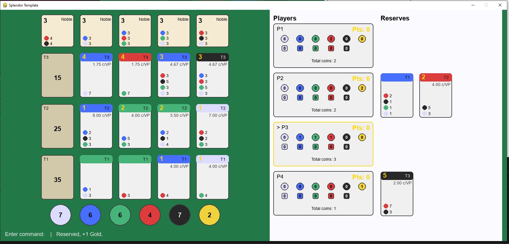

# Splendor

A playable implementation of the board game **Splendor** in Python, with a Pygame UI and a **Deep Q-Network (DQN)** agent that learns to play against random or checkpoint opponents.



*Screenshot of the game board during play. Run `python main.py` to try it yourself.*

---

## Overview

This project includes:

- **Full game engine** — Splendor rules: buying cards, taking tokens, reserving cards, noble visits, win condition (15+ points).
- **Interactive Pygame UI** — Play locally with keyboard input; view the board, gem bank, nobles, and player panels.
- **Reinforcement learning agent** — A DQN (PyTorch) trained with experience replay and epsilon-greedy exploration. The “hero” agent can be trained vs random opponents or vs a fixed checkpoint policy.

Useful for a portfolio: it combines game logic, a custom UI, and deep reinforcement learning in one codebase.

---

## Tech stack

- **Python 3**
- **Pygame** — 2D UI and input
- **PyTorch** — DQN model and training
- **NumPy** — State encoding and replay buffers

---

## Setup

1. **Clone the repo** (or download and extract).

2. **Create a virtual environment** (recommended):
   ```bash
   python -m venv venv
   source venv/bin/activate   # Windows: venv\Scripts\activate
   ```

3. **Install dependencies**:
   ```bash
   pip install -r requirements.txt
   ```

---

## How to run

### Play the game (UI)

```bash
python main.py
```

Starts a 4-player game. Type moves in the format your parser expects (e.g. `T(DSE)`, `R(0,3)`, `B(2,1)`), press Enter to apply. The status line shows the last result.

### Train the DQN

Train the hero agent vs **random** opponents (saves checkpoints as `hero_vs_random_*` or similar):

```bash
python deepqmodel.py --episodes 10000
```

Train vs a **checkpoint** opponent (saves as `hero_vs_checkpoint_*`):

```bash
python deepqmodel.py --opponent checkpoints/hero_bestwr.pt --episodes 5000
```

Options: `--start <path>` to load an initial hero policy, `--episodes N` for number of games.

### Replay a saved game

If you have a `.replay` file (e.g. from `inspect_games.py`):

```bash
python initalize_ui.py path/to/game.replay
```

Use **Left/Right** to step through moves, **R** to restart, **Q** or **Esc** to quit.

---

## Project structure

| Path | Description |
|------|-------------|
| `main.py` | Entry point: load game, run UI |
| `initalize_ui.py` | Pygame UI loop, drawing, replay viewer |
| `ui_components.py` | Card/noble/bank/player drawing and layout |
| `engine.py` | Game rules and move application |
| `game_state.py` | `GameState` and `Player` dataclasses |
| `loader.py` | Load cards, nobles, initial state, valid moves |
| `move_parser.py` | Parse move strings into engine format |
| `deepqmodel.py` | DQN model, replay buffer, training loop |
| `card.py`, `noble.py` | Card and noble types |
| `data/` | Card and noble data (CSV) |
| `checkpoints/` | Saved PyTorch checkpoints (optional, can be gitignored) |

---

## License

This is a personal/portfolio project. The game Splendor is a trademark of its respective owners; this code is for learning and demonstration only.
